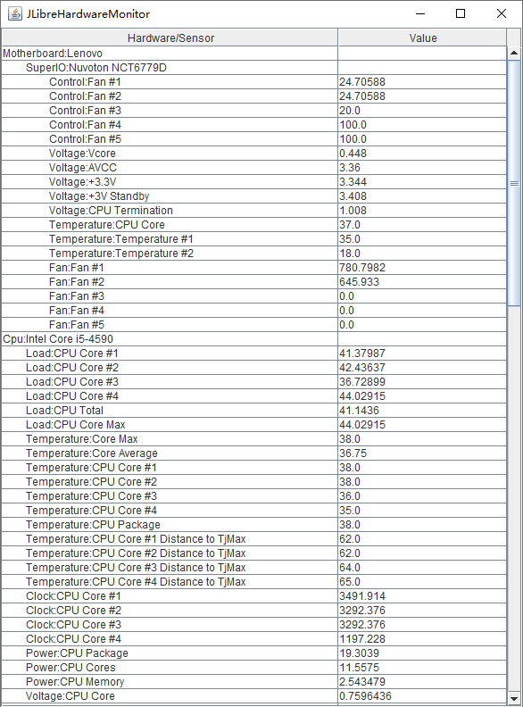

# jLibreHardwareMonitor

Monitor all the hardware sensors of your PC using Java by LibreHardwareMonitorLib

The supported .NET Framework versions range from 2.0 (the minimum) to 4.7.2 and above

Using bellow libraries(Automatically selecting based on .NET environment)

| Library | Version | .NET                           |
| --- |---------|--------------------------------| 
| LibreHardwareMonitorLib.dll | 0.9.4   | .NET Framework 4.7.2 and above |
| OpenHardwareMonitorLib.dll | 0.9.3   | .NET Framework 2.0             |

#### Example Output ####

    HardwareType:Motherboard, Name:Lenovo
        SubHardwareType:SuperIO, Name:Nuvoton NCT6779D
            SensorType:Control, Name:Fan #1, value:24.70588
            SensorType:Control, Name:Fan #2, value:24.70588
            SensorType:Control, Name:Fan #3, value:20.0
            SensorType:Control, Name:Fan #4, value:100.0
            SensorType:Control, Name:Fan #5, value:100.0
            SensorType:Voltage, Name:Vcore, value:0.448
            SensorType:Voltage, Name:AVCC, value:3.36
            SensorType:Voltage, Name:+3.3V, value:3.36
            SensorType:Voltage, Name:+3V Standby, value:3.408
            SensorType:Voltage, Name:CPU Termination, value:1.008
            SensorType:Temperature, Name:CPU Core, value:48.5
            SensorType:Temperature, Name:Temperature #1, value:39.0
            SensorType:Temperature, Name:Temperature #2, value:18.0
            SensorType:Fan, Name:Fan #1, value:787.172
            SensorType:Fan, Name:Fan #2, value:646.8615
            SensorType:Fan, Name:Fan #3, value:0.0
            SensorType:Fan, Name:Fan #4, value:0.0
            SensorType:Fan, Name:Fan #5, value:0.0
    HardwareType:Cpu, Name:Intel Core i5-4590
        SensorType:Load, Name:CPU Core #1, value:66.13708
        SensorType:Load, Name:CPU Core #2, value:61.60718
        SensorType:Load, Name:CPU Core #3, value:58.3219
        SensorType:Load, Name:CPU Core #4, value:61.86543
        SensorType:Load, Name:CPU Total, value:61.98289
        SensorType:Load, Name:CPU Core Max, value:66.13708
        SensorType:Temperature, Name:Core Max, value:50.0
        SensorType:Temperature, Name:Core Average, value:48.25
        SensorType:Temperature, Name:CPU Core #1, value:50.0
        SensorType:Temperature, Name:CPU Core #2, value:49.0
        SensorType:Temperature, Name:CPU Core #3, value:48.0
        SensorType:Temperature, Name:CPU Core #4, value:46.0
        SensorType:Temperature, Name:CPU Package, value:50.0
        SensorType:Temperature, Name:CPU Core #1 Distance to TjMax, value:50.0
        SensorType:Temperature, Name:CPU Core #2 Distance to TjMax, value:51.0
        SensorType:Temperature, Name:CPU Core #3 Distance to TjMax, value:52.0
        SensorType:Temperature, Name:CPU Core #4 Distance to TjMax, value:54.0
        SensorType:Clock, Name:CPU Core #1, value:3292.377
        SensorType:Clock, Name:CPU Core #2, value:3292.377
        SensorType:Clock, Name:CPU Core #3, value:3491.915
        SensorType:Clock, Name:CPU Core #4, value:3292.377
        SensorType:Power, Name:CPU Package, value:28.13353
        SensorType:Power, Name:CPU Cores, value:19.21666
        SensorType:Power, Name:CPU Memory, value:3.161473
        SensorType:Voltage, Name:CPU Core, value:1.007202
        SensorType:Voltage, Name:CPU Core #1, value:1.002319
        SensorType:Voltage, Name:CPU Core #2, value:1.004761
        SensorType:Voltage, Name:CPU Core #3, value:1.004761
        SensorType:Voltage, Name:CPU Core #4, value:1.007202
        SensorType:Clock, Name:Bus Speed, value:99.769
    HardwareType:Memory, Name:Generic Memory
        SensorType:Data, Name:Memory Used, value:15.01143
        SensorType:Data, Name:Memory Available, value:0.9034576
        SensorType:Load, Name:Memory, value:94.32319
        SensorType:Data, Name:Virtual Memory Used, value:21.16336
        SensorType:Data, Name:Virtual Memory Available, value:3.488129
        SensorType:Load, Name:Virtual Memory, value:85.85023
    HardwareType:GpuIntel, Name:Intel(R) HD Graphics 4600
        SensorType:Power, Name:GPU Power, value:0.317177
        SensorType:SmallData, Name:D3D Shared Memory Total, value:2048.0
        SensorType:SmallData, Name:D3D Shared Memory Free, value:0.0
        SensorType:SmallData, Name:D3D Shared Memory Used, value:122.7773
        SensorType:Load, Name:D3D 3D, value:5.905062
        SensorType:Load, Name:D3D Video Decode, value:0.0
        SensorType:Load, Name:D3D Copy, value:0.0
        SensorType:Load, Name:D3D Video Processing, value:0.0
        SensorType:Load, Name:D3D Video Decode, value:0.0
        SensorType:Load, Name:D3D Other, value:0.0
        SensorType:Load, Name:D3D Overlay, value:0.0
        SensorType:Load, Name:D3D GDI Render, value:0.0
        SensorType:Load, Name:D3D Video Processing, value:0.0
    HardwareType:Storage, Name:SanDisk SSD PLUS 120GB
        SensorType:Temperature, Name:Temperature, value:26.0
        SensorType:Load, Name:Used Space, value:80.45492
        SensorType:Load, Name:Read Activity, value:7.486434E-5
        SensorType:Load, Name:Write Activity, value:6.909168E-5
        SensorType:Load, Name:Total Activity, value:99.99541
        SensorType:Throughput, Name:Read Rate, value:0.0
        SensorType:Throughput, Name:Write Rate, value:0.0
    HardwareType:Storage, Name:WDC WD10EZEX-08WN4A0
        SensorType:Temperature, Name:Temperature, value:29.0
        SensorType:Load, Name:Used Space, value:35.65495
        SensorType:Load, Name:Read Activity, value:3.311566E-4
        SensorType:Load, Name:Write Activity, value:1.172971E-4
        SensorType:Load, Name:Total Activity, value:99.99568
        SensorType:Throughput, Name:Read Rate, value:0.0
        SensorType:Throughput, Name:Write Rate, value:0.0
    HardwareType:Network, Name:Ethernet
        SensorType:Data, Name:Data Uploaded, value:8.787435
        SensorType:Data, Name:Data Downloaded, value:17.11047
        SensorType:Throughput, Name:Upload Speed, value:421.8286
        SensorType:Throughput, Name:Download Speed, value:2126.538
        SensorType:Load, Name:Network Utilization, value:0.02038693
    HardwareType:Network, Name:VMware Network Adapter VMnet1
        SensorType:Data, Name:Data Uploaded, value:6.874092E-6
        SensorType:Data, Name:Data Downloaded, value:1.899898E-7
        SensorType:Throughput, Name:Upload Speed, value:0.0
        SensorType:Throughput, Name:Download Speed, value:0.0
        SensorType:Load, Name:Network Utilization, value:0.0
        HardwareType:Network, Name:VMware Network Adapter VMnet8
        SensorType:Data, Name:Data Uploaded, value:2.784003E-5
        SensorType:Data, Name:Data Downloaded, value:1.899898E-7
        SensorType:Throughput, Name:Upload Speed, value:0.0
        SensorType:Throughput, Name:Download Speed, value:0.0
        SensorType:Load, Name:Network Utilization, value:0.0
    HardwareType:Network, Name:VPN
        SensorType:Data, Name:Data Uploaded, value:0.0
        SensorType:Data, Name:Data Downloaded, value:0.0
        SensorType:Throughput, Name:Upload Speed, value:0.0
        SensorType:Throughput, Name:Download Speed, value:0.0
        SensorType:Load, Name:Network Utilization, value:0.0
    HardwareType:Network, Name:Virtual Network
        SensorType:Data, Name:Data Uploaded, value:0.0
        SensorType:Data, Name:Data Downloaded, value:0.0
        SensorType:Throughput, Name:Upload Speed, value:0.0
        SensorType:Throughput, Name:Download Speed, value:0.0
        SensorType:Load, Name:Network Utilization, value:0.0

**IMPORTANT NOTE:** if you are getting 0.0 as temperature value, try to launch as Administrator

## Installation ##

To install jLibreHardwareMonitor for Maven you have just to add to your pom.xml: 

     <dependency>
          <groupId>io.github.pandalxb</groupId>
          <artifactId>jLibreHardwareMonitor</artifactId>
          <version>1.0.1</version>
     </dependency>


## Basic Usage ##

### Use as a library ###

In order to retrieve all sensors data, it is only necessary to call the method _getComputer()_.

It will retrieve a list of hardware components of your computer...

#### Get all sensors ####
```java
    System.out.println("Scanning sensors data...");
    
    Computer computer = LibreHardwareManager.createInstance(ComputerConfig.getInstance().enableAll()).getComputer();
    for (final Hardware hardware : computer.getHardware()) {
        System.out.println(String.format("HardwareType:%s, Name:%s", hardware.getHardwareType(), hardware.getName()));
        for (final Hardware subHardware : hardware.getSubHardware()) {
            System.out.println(String.format("	SubHardwareType:%s, Name:%s", subHardware.getHardwareType(), subHardware.getName()));
            for (final Sensor sensor : subHardware.getSensors()) {
                System.out.println(String.format("		SensorType:%s, Name:%s, value:%s", sensor.getSensorType(), sensor.getName(), sensor.getValue()));
            }
        }
        for (final Sensor sensor : hardware.getSensors()) {
            System.out.println(String.format("	SensorType:%s, Name:%s, value:%s", sensor.getSensorType(), sensor.getName(), sensor.getValue()));
        }
    }
```

#### Get the specified sensors ####
```java
    LibreHardwareManager libreHardwareManager = LibreHardwareManager.createInstance(ComputerConfig.getInstance().setCpuEnabled(true));
    List<Sensor> sensors = libreHardwareManager.querySensors("CPU", "Temperature");
    System.out.println("sensors:" + sensors);
```

### Use as a standalone application ###

First of all, download the JAR file containing all dependencies: https://repo1.maven.org/maven2/io/github/pandalxb/jLibreHardwareMonitor/1.0.1/jLibreHardwareMonitor-1.0.0-jar-with-dependencies.jar

Execute jLibreHardwareMonitor and get all sensors data: 

```
    java -jar jLibreHardwareMonitor-1.0.1-jar-with-dependencies.jar
```

This will generate a console output. 


It is also possible to show a simple gui with all the sensors data:

```
    java -jar jLibreHardwareMonitor-1.0.1-jar-with-dependencies.jar --gui
```
Result:


